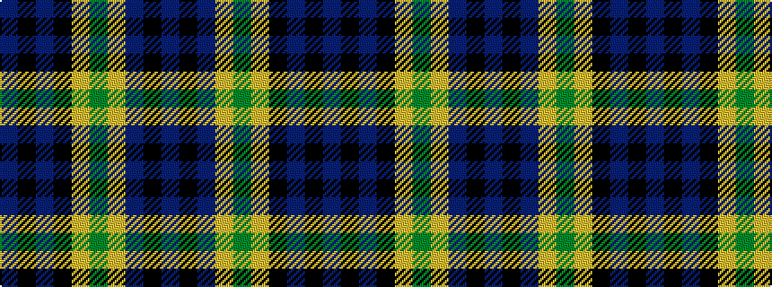

BKBKYGYBKB

It is a 10 stripe tartan.

<figure class="pat-woven">

<figcaption>idealised sample</figcaption>
</figure>

## Colour Sequence



## Tartans with this colour sequence

| Tartans |
|---------------|
| [Rowan (Name)](/variants/s10/db1k1db8k2lo1g12lo1db8k1db1~x4/)|
||
