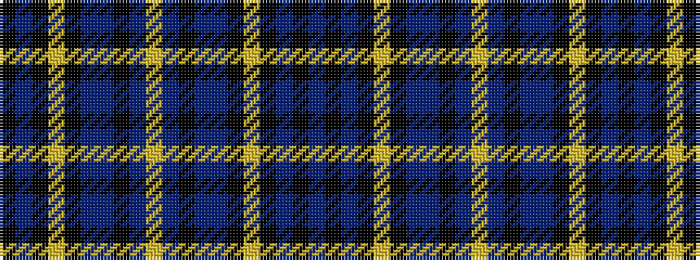

BKBKYKBBKBYBKBBKYKBK

It is a 20 stripe tartan.

<figure class="pat-woven">

<figcaption>idealised sample</figcaption>
</figure>

## Colour Sequence



## Tartans with this colour sequence

| Tartans |
|---------------|
| [Skye, Isle of](/setts/s20/b45k10n2k2lo2k2n10b4k1b5lo1~x2/)|
||
