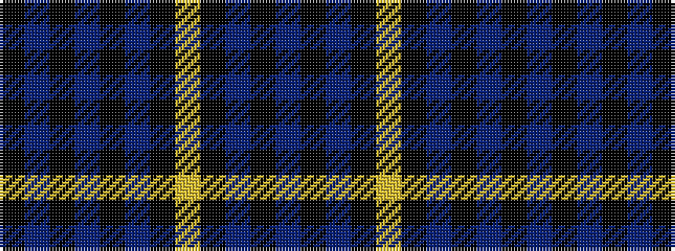

BKBKYKBKBKBK

It is a 12 stripe tartan.

<figure class="pat-woven">

<figcaption>idealised sample</figcaption>
</figure>

## Colour Sequence



## Tartans with this colour sequence

| Tartans |
|---------------|
| [Daniel (Welsh Name)](/setts/s12/k5db26k2db4k2db26k3lr36k3dt30k3t2/)|
||
