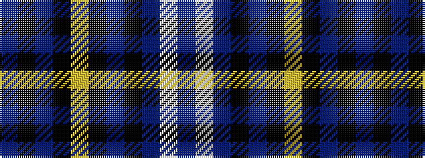

BKBKYKBKBWB

It is a 11 stripe tartan.

<figure class="pat-woven">

<figcaption>idealised sample</figcaption>
</figure>

## Colour Sequence



## Tartans with this colour sequence

| Tartans |
|---------------|
| [Haus of RvR](/variants/s11/dbi13w2dbi13k3db13k21lo3k18dbi9k2dbi2~x2/)|
||
