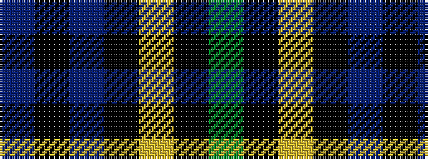

BKBKYKG

It is a 7 stripe tartan.

<figure class="pat-woven">

<figcaption>idealised sample</figcaption>
</figure>

## Colour Sequence



## Tartans with this colour sequence

| Tartans |
|---------------|
| [Mowat](/variants/s7/db48k6db10k46ly4k22g43/)|
||
| [Mowat (Clans Originaux)](/variants/s7/db24k3db5k23ly2k11g22~x2/)|
||
