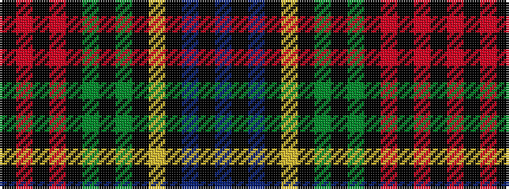

BKBKYKGKGKRKRK

It is a 14 stripe tartan.

<figure class="pat-woven">

<figcaption>idealised sample</figcaption>
</figure>

## Colour Sequence



## Tartans with this colour sequence

| Tartans |
|---------------|
| [Deas](/variants/s14/db21k2db2k12ly3k12g2k2g21k2r8k6r8k2~x2/)|
||
