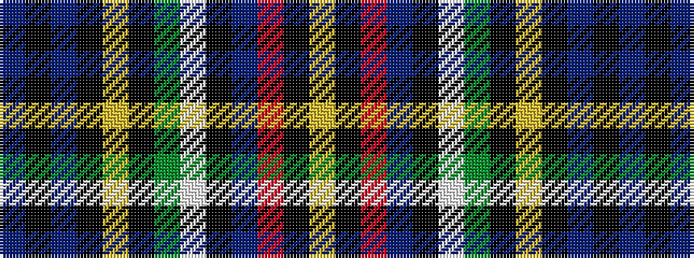

BKBKYKGWKBRKY

It is a 13 stripe tartan.

<figure class="pat-woven">

<figcaption>idealised sample</figcaption>
</figure>

## Colour Sequence



## Tartans with this colour sequence

| Tartans |
|---------------|
| [Allison](/setts/s13/db3k3db15k15ly3k3g15w3k15db4r6k3ly1~x2/)|
||
