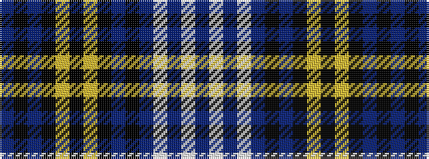

BKBKYKYKBKBWBWB

It is a 15 stripe tartan.

<figure class="pat-woven">

<figcaption>idealised sample</figcaption>
</figure>

## Colour Sequence



## Tartans with this colour sequence

| Tartans |
|---------------|
| [Skarpathiotakis, George (Personal)](/setts/s15/db2k4db9k4ly4k3ly2k5db4k3db18w2db2w2db2~x2/)|
||
