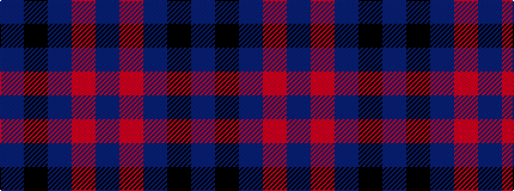

BKBRB

It is a 5 stripe tartan.

<figure class="pat-woven">

<figcaption>idealised sample</figcaption>
</figure>

## Colour Sequence



## Tartans with this colour sequence

| Tartans |
|---------------|
| [Passion of Scotland, Pewter (Fashion](/variants/s5/n8o3ni34k34dp3~x2/)|
||
