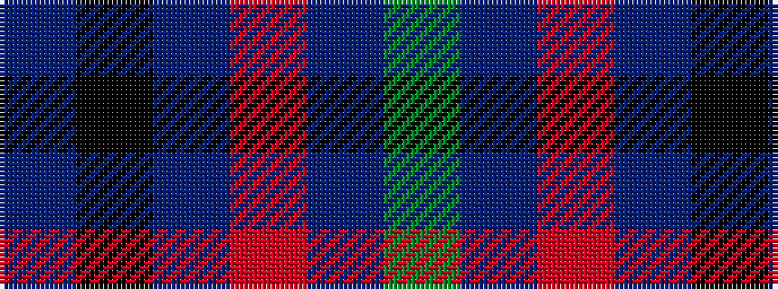

BKBRBG

It is a 6 stripe tartan.

<figure class="pat-woven">

<figcaption>idealised sample</figcaption>
</figure>

## Colour Sequence



## Tartans with this colour sequence

| Tartans |
|---------------|
| [Nicolson of Tiree & Coll (Clan)](/setts/s6/g3db8r11dt3k2dp2~x4/)|
||
