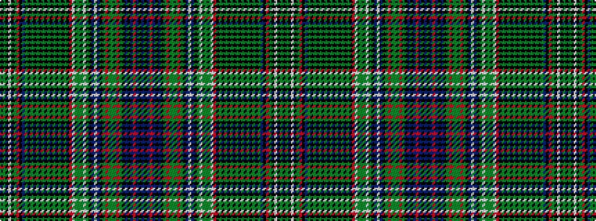

BKBRBKBKGRGGGRGKBWBKGWGGGWRKGKGKGKGKGKGKGKGBKRGKWKGK

It is a 52 stripe tartan.

<figure class="pat-woven">

<figcaption>idealised sample</figcaption>
</figure>

## Colour Sequence



## Tartans with this colour sequence

This pattern is a design lineage: every tartan below shares one colour order, whatever its owner —
near-identical designs are grouped, the largest lineage first (#112: the pattern is a tartan's
second parent, beside its family or clan).

<table class="sett-table">
<tbody>
<tr><td><a href="/variants/s52/k1g10k4w1k4g10r1k4db3dy1k1dy1k1dy1k1dy1k1dy1k1dy1k1dy1k1dy1k5r20w2g3dy3g3w2g20k4db4w2db4k4g10r3g3dy2g3r3g10k1db1k1db7r2db7k1db1~x2/">Lawson, Robin (Personal)</a></td></tr>
<tr><td class="sett-swatch"></td></tr>
</tbody>
</table>

