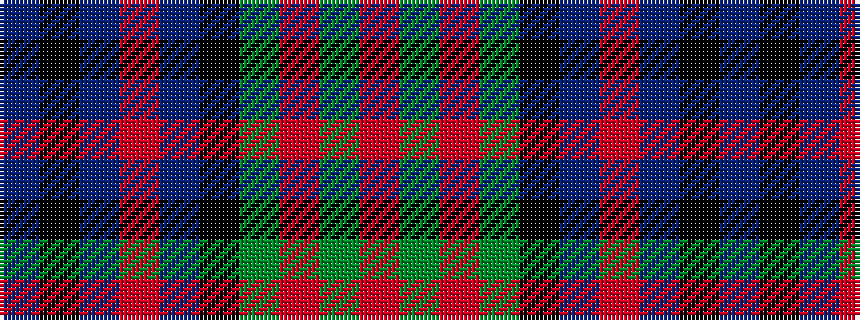

BKBRBKGRGR

It is a 10 stripe tartan.

<figure class="pat-woven">

<figcaption>idealised sample</figcaption>
</figure>

## Colour Sequence



## Tartans with this colour sequence

| Tartans |
|---------------|
| [Cartier, Sir George Etienne](/variants/s10/r4dg6o3dg10k14n6r18n6k4n2~x2/)|
||
