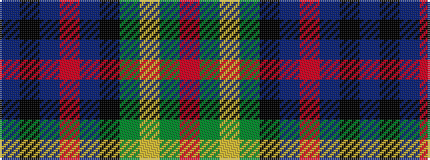

BKBRBKGYGR

It is a 10 stripe tartan.

<figure class="pat-woven">

<figcaption>idealised sample</figcaption>
</figure>

## Colour Sequence



## Tartans with this colour sequence

| Tartans |
|---------------|
| [Etienne-Carter, Sir George](/setts/s10/r4g6ly3g12k14db5r20db5k4db2~x2/)|
||
| [Unidentified #9](/setts/s10/r4dg7ly3dg12k16t5r20t5k4t2~x2/)|
||
| [Unidentified 25](/setts/s10/r4g7ly3g12k16t5r20t5k4t2~x2/)|
||
