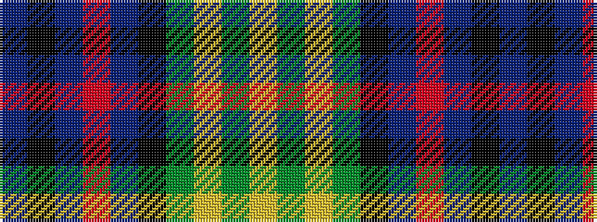

BKBRBKGYGY

It is a 10 stripe tartan.

<figure class="pat-woven">

<figcaption>idealised sample</figcaption>
</figure>

## Colour Sequence



## Tartans with this colour sequence

| Tartans |
|---------------|
| [Watson (Name)](/setts/s10/db24k2db2r2db2k20g16ly2g2ly3~x2/)|
||
