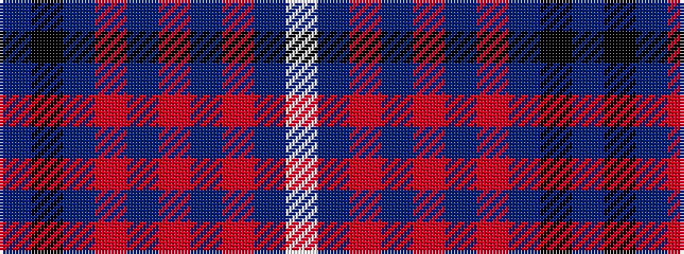

BKBRBRBRBW

It is a 10 stripe tartan.

<figure class="pat-woven">

<figcaption>idealised sample</figcaption>
</figure>

## Colour Sequence



## Tartans with this colour sequence

| Tartans |
|---------------|
| [Digital](/setts/s10/b6k3b10o5b2o2b2o2b7w2~x2/)|
||
| [Digital Equipment Corp.](/setts/s10/n8k5n16o9n3o3n3o3n10lb3~x2/)|
||
