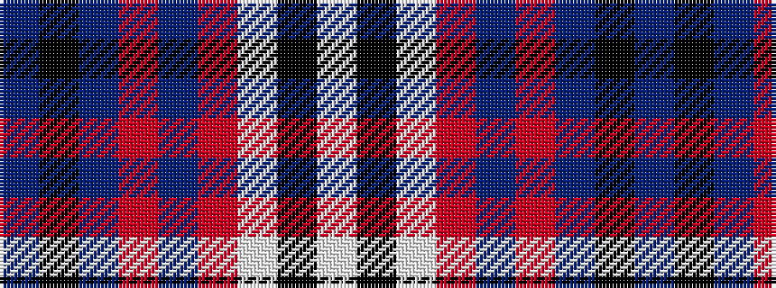

BKBRBRWKW

It is a 9 stripe tartan.

<figure class="pat-woven">

<figcaption>idealised sample</figcaption>
</figure>

## Colour Sequence



## Tartans with this colour sequence

| Tartans |
|---------------|
| [Ainslie](/setts/s9/db12k3db2r2db2r12w2k1w2~x4/)|
||
| [Ainslie](/setts/s9/db23k4db4r4db4r25w4k4w4~x2/)|
||
