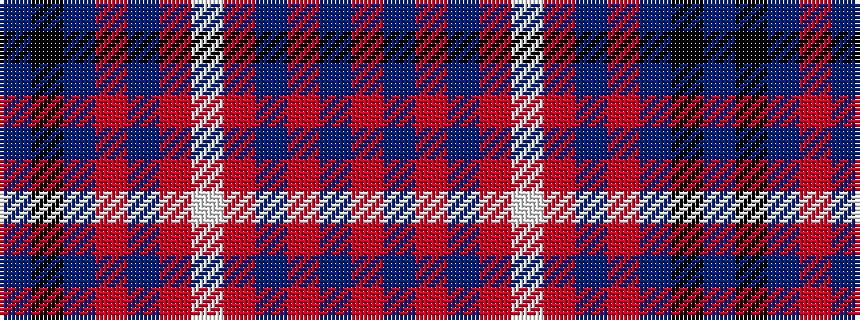

BKBRBRWRBRBR

It is a 12 stripe tartan.

<figure class="pat-woven">

<figcaption>idealised sample</figcaption>
</figure>

## Colour Sequence



## Tartans with this colour sequence

| Tartans |
|---------------|
| [Tullis Russell](/variants/s12/db9k16db9r7db4r9w2r2b2r9db4r7~x2/)|
||
