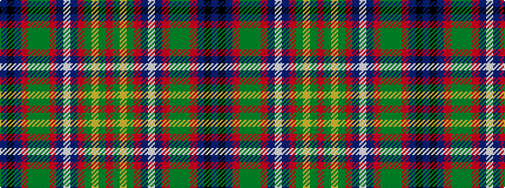

BKBRGGGRBWBRGYGR

It is a 16 stripe tartan.

<figure class="pat-woven">

<figcaption>idealised sample</figcaption>
</figure>

## Colour Sequence



## Tartans with this colour sequence

| Tartans |
|---------------|
| [Amnesty (Commemorative)](/variants/s16/db42k5db42o32dg42dy5dg42o32db42w5db42o32dg42lo5dg42o32/)|
||
