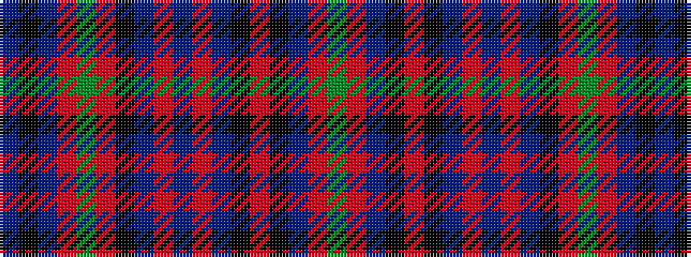

BKBRGRKBRBRBKRKBRG

It is a 18 stripe tartan.

<figure class="pat-woven">

<figcaption>idealised sample</figcaption>
</figure>

## Colour Sequence



## Tartans with this colour sequence

| Tartans |
|---------------|
| [Dundas (Red)](/variants/s18/dg4r4dp1k1r19k1t1r2db5r2t1k1r2dg24r5dp1k1t3~x2/)|
||
| [Dundas, (Red)](/variants/s18/g4r4dp1k1r19k1t1r2db5r2t1k1r2g24r5dp1k1t3~x2/)|
||
