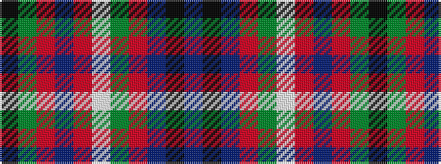

BKBRGWRBRGK

It is a 11 stripe tartan.

<figure class="pat-woven">

<figcaption>idealised sample</figcaption>
</figure>

## Colour Sequence



## Tartans with this colour sequence

| Tartans |
|---------------|
| [MacArthur-Fox Dress (Personal)](/setts/s11/t4k2db3r33g9w3r5db10r6g2k2~x2/)|
||
