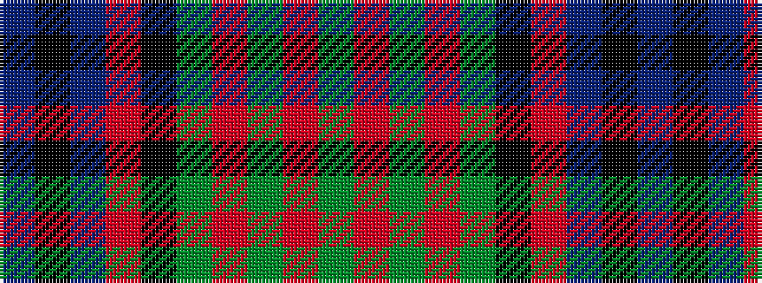

BKBRKGRGRG

It is a 10 stripe tartan.

<figure class="pat-woven">

<figcaption>idealised sample</figcaption>
</figure>

## Colour Sequence



## Tartans with this colour sequence

| Tartans |
|---------------|
| [Newlands](/setts/s10/db9k9db9r2k18g12r2g4r2g4~x2/)|
||
| [Newlands of Lauriston](/setts/s10/b9k9b9r2k20g13r2g4r2g4~x2/)|
||
