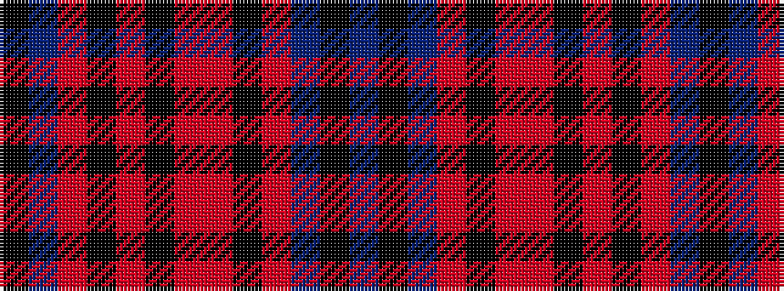

BKBRKRRKRKRBK

It is a 13 stripe tartan.

<figure class="pat-woven">

<figcaption>idealised sample</figcaption>
</figure>

## Colour Sequence



## Tartans with this colour sequence

| Tartans |
|---------------|
| [Franklin (District)](/setts/s13/k2db3o5k1o2k1o5r3k2r3db6k1db1~x4/)|
||
