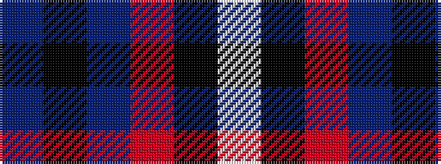

BKBRKW

It is a 6 stripe tartan.

<figure class="pat-woven">

<figcaption>idealised sample</figcaption>
</figure>

## Colour Sequence



## Tartans with this colour sequence

| Tartans |
|---------------|
| [Wylie](/setts/s6/n45k3n10o4ki1w2~x4/)|
||
