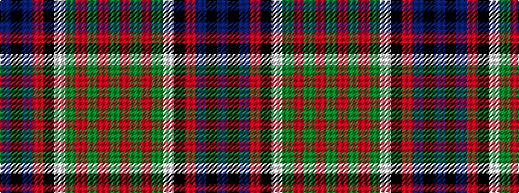

BKBRKWGRGRG

It is a 11 stripe tartan.

<figure class="pat-woven">

<figcaption>idealised sample</figcaption>
</figure>

## Colour Sequence



## Tartans with this colour sequence

| Tartans |
|---------------|
| [Newman](/variants/s11/db10k10db10r2k20w1g10r2g4r2g4~x2/)|
||
| [Newman](/variants/s11/db9k9db9r2k18w1g12r2g4r2g4~x2/)|
||
