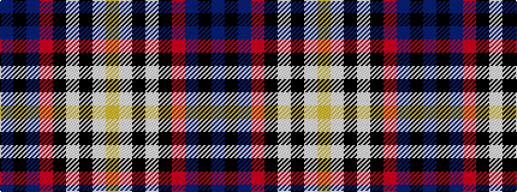

BKBRKWKWY

It is a 9 stripe tartan.

<figure class="pat-woven">

<figcaption>idealised sample</figcaption>
</figure>

## Colour Sequence



## Tartans with this colour sequence

| Tartans |
|---------------|
| [Carbon (Corporate)](/variants/s9/n68k4n18o20k3w3k10lb8lo4/)|
||
