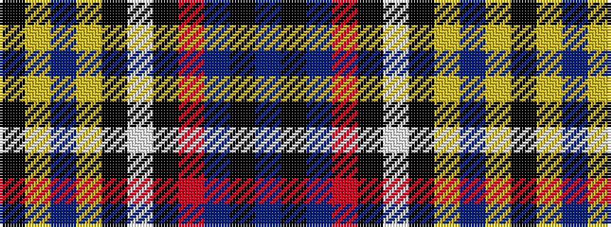

BKBRKWKYBYK

It is a 11 stripe tartan.

<figure class="pat-woven">

<figcaption>idealised sample</figcaption>
</figure>

## Colour Sequence



## Tartans with this colour sequence

| Tartans |
|---------------|
| [Misty Isle (Fashion)](/variants/s11/k4lr3dt49lr4k2lb5k6o10n15k1dt2~x2/)|
||
