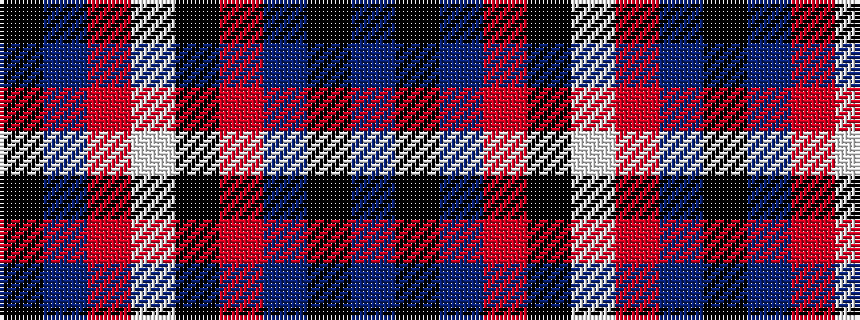

BKBRKWRBK

It is a 9 stripe tartan.

<figure class="pat-woven">

<figcaption>idealised sample</figcaption>
</figure>

## Colour Sequence



## Tartans with this colour sequence

| Tartans |
|---------------|
| [Universal Scientific Indust (Corp.)](/variants/s9/k38t2m24w2k16m6t2k3t5~x2/)|
||
