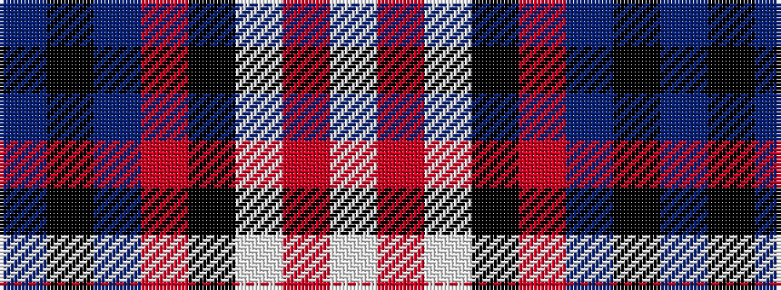

BKBRKWRW

It is a 8 stripe tartan.

<figure class="pat-woven">

<figcaption>idealised sample</figcaption>
</figure>

## Colour Sequence



## Tartans with this colour sequence

| Tartans |
|---------------|
| [Yale College, Wrexham](/setts/s8/t57k5t9m29k18w9m9w5/)|
||
