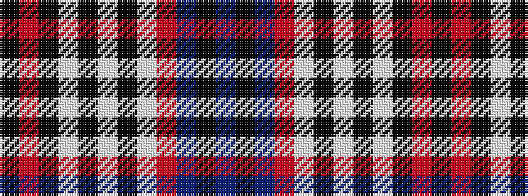

BKBRWKWKWKRK

It is a 12 stripe tartan.

<figure class="pat-woven">

<figcaption>idealised sample</figcaption>
</figure>

## Colour Sequence



## Tartans with this colour sequence

| Tartans |
|---------------|
| [Bishop](/setts/s12/k2r12k21w1k4w1k21w3r3db18k2db1~x2/)|
||
