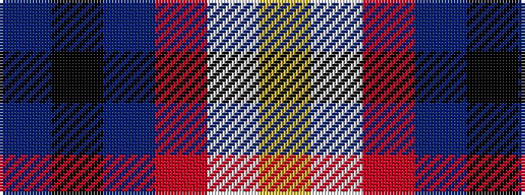

BKBRWY

It is a 6 stripe tartan.

<figure class="pat-woven">

<figcaption>idealised sample</figcaption>
</figure>

## Colour Sequence



## Tartans with this colour sequence

| Tartans |
|---------------|
| [McHale, Barry](/setts/s6/t15k10dt30o11w3lg5~x2/)|
||
