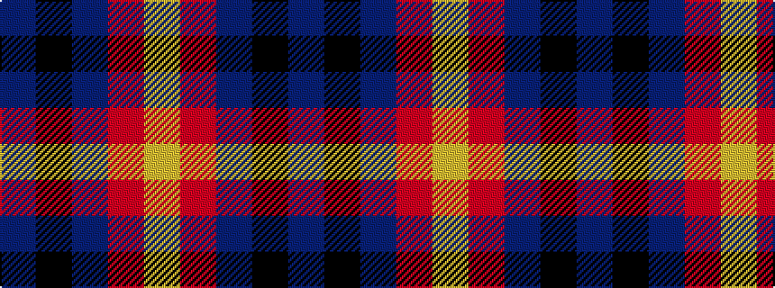

BKBRY

It is a 5 stripe tartan.

<figure class="pat-woven">

<figcaption>idealised sample</figcaption>
</figure>

## Colour Sequence



## Tartans with this colour sequence

| Tartans |
|---------------|
| [Chivas Regal](/setts/s5/dt6k6dt6r14ly3~x2/)|
||
| [Chivas Regal (Corporate)](/setts/s5/dt2k2dt2r5ly1~x12/)|
||
| [Highland Pub Company](/setts/s5/db13k13db13r29ly4~x2/)|
||
| [Highland Pub Company](/setts/s5/do16k13do13r30lo4~x2/)|
||
