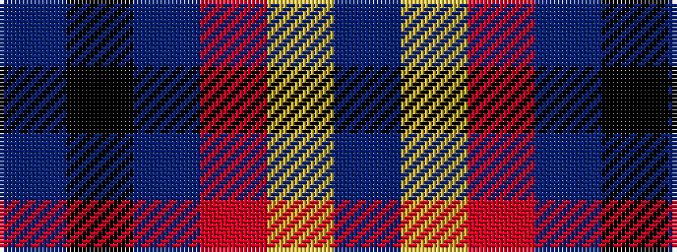

BKBRYB

It is a 6 stripe tartan.

<figure class="pat-woven">

<figcaption>idealised sample</figcaption>
</figure>

## Colour Sequence



## Tartans with this colour sequence

| Tartans |
|---------------|
| [Meeson Dress Personal Tartan Tartan Number: 6026. Earliest known date: 2007 Formal Dress version. The gray was originally woven with a melange or marled yarn. See products available Copyright © Blair Urquhart, Comrie, 2015](/setts/s6/t26k10dt19r6ly2db9~x2/)|
||
