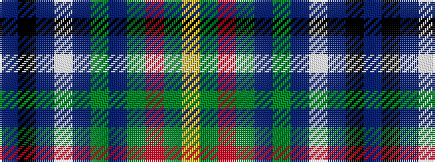

BKBWBGBGRGY

It is a 11 stripe tartan.

<figure class="pat-woven">

<figcaption>idealised sample</figcaption>
</figure>

## Colour Sequence



## Tartans with this colour sequence

| Tartans |
|---------------|
| [O'Sullivan](/setts/s11/b6k4b10w2db10g4db6g9r2g4ly2~x4/)|
||
