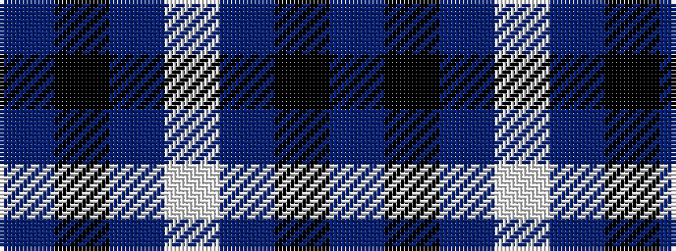

BKBWBKB

It is a 7 stripe tartan.

<figure class="pat-woven">

<figcaption>idealised sample</figcaption>
</figure>

## Colour Sequence



## Tartans with this colour sequence

| Tartans |
|---------------|
| [St. Andrew Society](/setts/s7/dbi16k16db16w3db16k2t3~x2/)|
||
