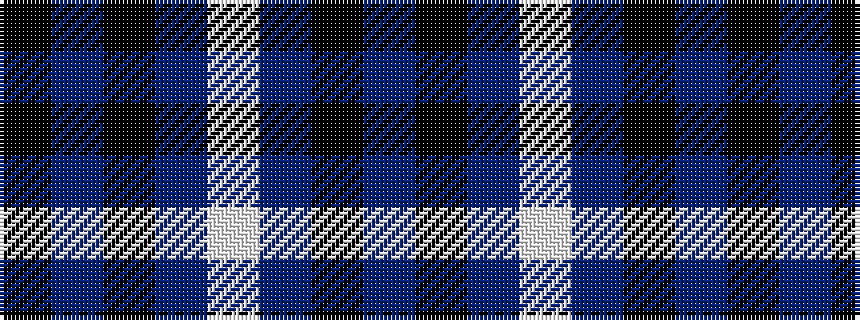

BKBWBKBK

It is a 8 stripe tartan.

<figure class="pat-woven">

<figcaption>idealised sample</figcaption>
</figure>

## Colour Sequence



## Tartans with this colour sequence

| Tartans |
|---------------|
| [Grampian Television](/setts/s8/k12n3k12n18w5~x2/)|
||
