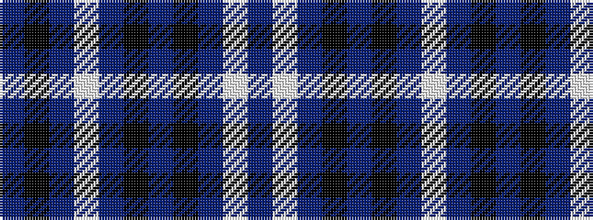

BKBWBKBKBWB

It is a 11 stripe tartan.

<figure class="pat-woven">

<figcaption>idealised sample</figcaption>
</figure>

## Colour Sequence



## Tartans with this colour sequence

| Tartans |
|---------------|
| [Newlands, Charlie (Personal)](/setts/s11/db6k2dp9lb1dp9k2dt4k6dt24w1db6~x2/)|
||
