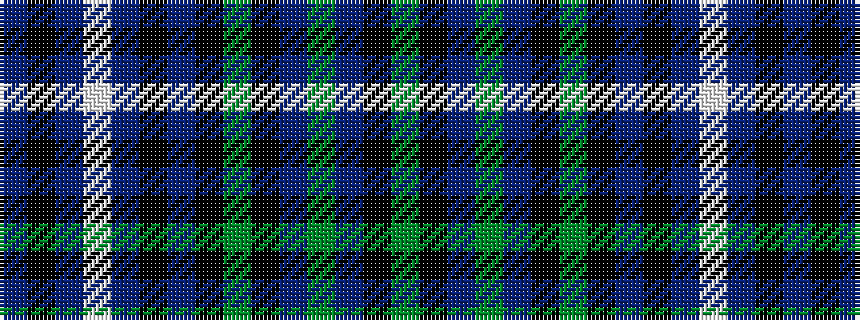

BKBWBKBKGKBGBKG

It is a 15 stripe tartan.

<figure class="pat-woven">

<figcaption>idealised sample</figcaption>
</figure>

## Colour Sequence



## Tartans with this colour sequence

| Tartans |
|---------------|
| [Redgate (Connecticut) Hunting #2](/variants/s15/do5k2n6w1n6k2do7k16dg7k2dr4dg2dr4k2dg4~x2/)|
||
