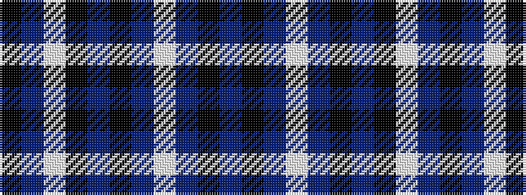

BKBWBKBKWBK

It is a 11 stripe tartan.

<figure class="pat-woven">

<figcaption>idealised sample</figcaption>
</figure>

## Colour Sequence



## Tartans with this colour sequence

| Tartans |
|---------------|
| [Clark (Crook)](/variants/s11/k1t1lp7k8t1k8t1lp2t1k4t1~x4/)|
||
| [Clergy, or Priest](/variants/s11/k1b1lp7k8b1k8b1lp2b1k4b1~x4/)|
||
