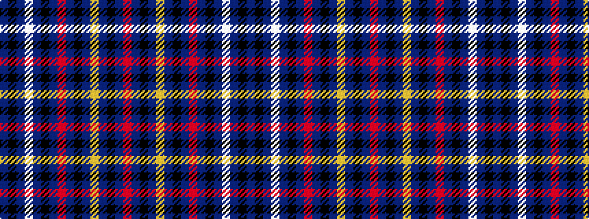

BKBWBKBRBKBYBKBR

It is a 16 stripe tartan.

<figure class="pat-woven">

<figcaption>idealised sample</figcaption>
</figure>

## Colour Sequence



## Tartans with this colour sequence

| Tartans |
|---------------|
| [Highland Titles (Corporate)](/variants/s16/r40dt25k20db15ly6db15k20dt25r40dt25k20db15w4db15k20dt25/)|
||
