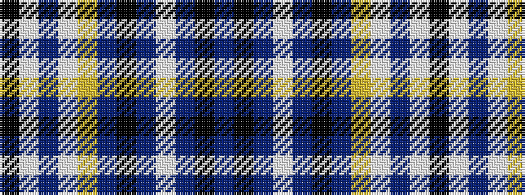

BKBWBKBYWBWK

It is a 12 stripe tartan.

<figure class="pat-woven">

<figcaption>idealised sample</figcaption>
</figure>

## Colour Sequence



## Tartans with this colour sequence

| Tartans |
|---------------|
| [London Fog Blue (Fashion)](/setts/s12/t144k9t13lb9t4k9t4lr13lb9t4lb13k4/)|
||
