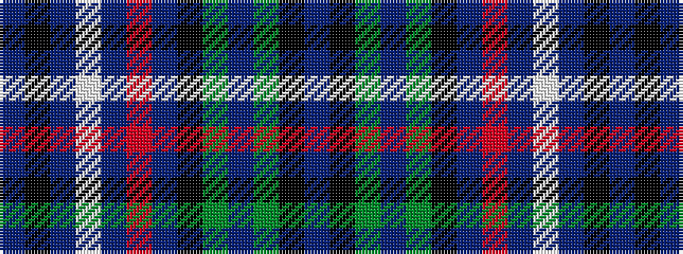

BKBWBRBKGBGKB

It is a 13 stripe tartan.

<figure class="pat-woven">

<figcaption>idealised sample</figcaption>
</figure>

## Colour Sequence



## Tartans with this colour sequence

| Tartans |
|---------------|
| [MacKusick (Piper) #2 (Personal)](/setts/s13/dp3k2dp5lb2db12r1db2k1g9dp3g5k12db2~x2/)|
||
