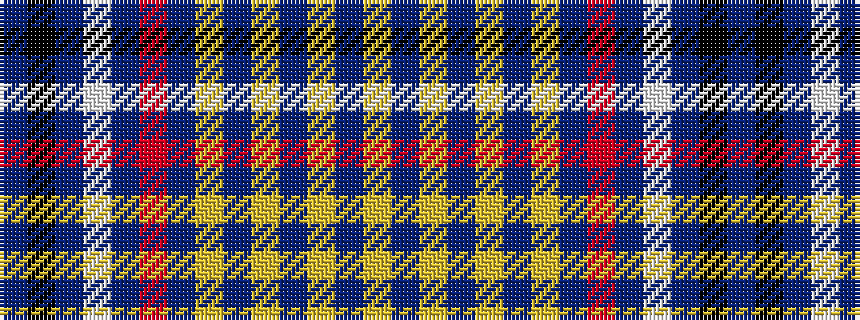

BKBWBRBYBYBYBY

It is a 14 stripe tartan.

<figure class="pat-woven">

<figcaption>idealised sample</figcaption>
</figure>

## Colour Sequence



## Tartans with this colour sequence

| Tartans |
|---------------|
| [King Pootatau Te Wherowhero](/variants/s14/db23k1db1w1db1r1db4lo2db1lo2db1lo2db1lo2~x2/)|
||
