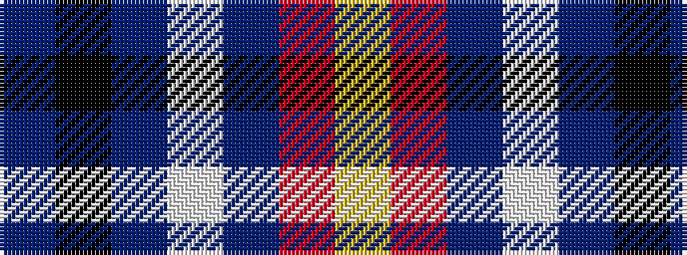

BKBWBRY

It is a 7 stripe tartan.

<figure class="pat-woven">

<figcaption>idealised sample</figcaption>
</figure>

## Colour Sequence



## Tartans with this colour sequence

| Tartans |
|---------------|
| [Laidlaw's Highland Drovers (Corp)](/variants/s7/db35k10db4w2db3r2ly2~x2/)|
||
