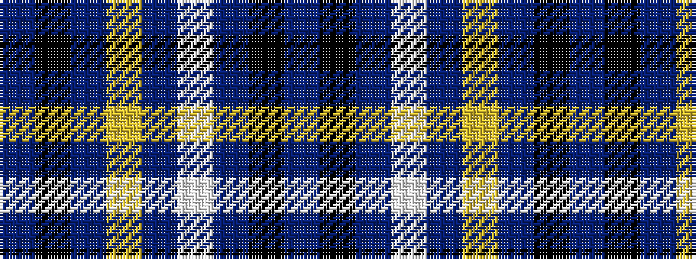

BKBWBYBKB

It is a 9 stripe tartan.

<figure class="pat-woven">

<figcaption>idealised sample</figcaption>
</figure>

## Colour Sequence



## Tartans with this colour sequence

| Tartans |
|---------------|
| [Kansas State University](/variants/s9/dp60k10dp6lr6dp6w4dp4k15dp15/)|
||
