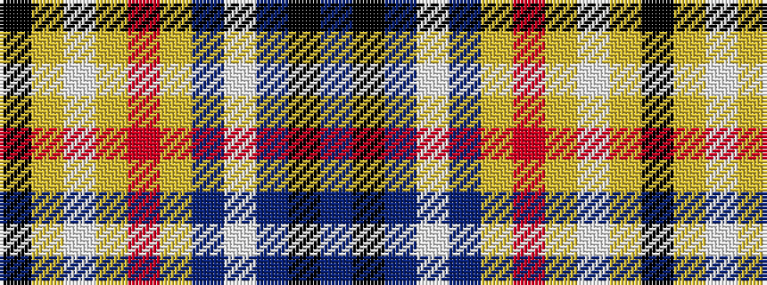

BKBWBYRYWYK

It is a 11 stripe tartan.

<figure class="pat-woven">

<figcaption>idealised sample</figcaption>
</figure>

## Colour Sequence



## Tartans with this colour sequence

| Tartans |
|---------------|
| [Gouranga](/variants/s11/b15k3b19w3b5ly5r3ly5lb3ly5k3~x2/)|
||
