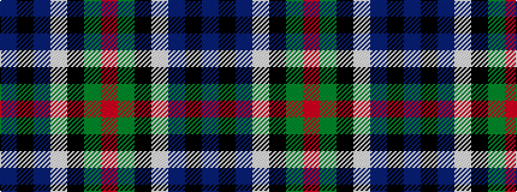

BKBWKGR

It is a 7 stripe tartan.

<figure class="pat-woven">

<figcaption>idealised sample</figcaption>
</figure>

## Colour Sequence



## Tartans with this colour sequence

| Tartans |
|---------------|
| [Colquhoun](/variants/s7/db4k2db16w1k8g24r4~x2/)|
||
| [Colquhoun](/variants/s7/db4k2db16w1k8dg24r4~x2/)|
||
| [Colquhoun VS](/variants/s7/db4k2db16lb1k8dg24r4/)|
||
