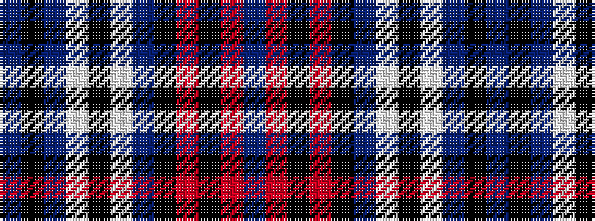

BKBWKWBKRKRB

It is a 12 stripe tartan.

<figure class="pat-woven">

<figcaption>idealised sample</figcaption>
</figure>

## Colour Sequence



## Tartans with this colour sequence

| Tartans |
|---------------|
| [Trillard (Personal)](/variants/s12/b4r3k3r6k8b10w8k12w8b24k2b2~x2/)|
||
