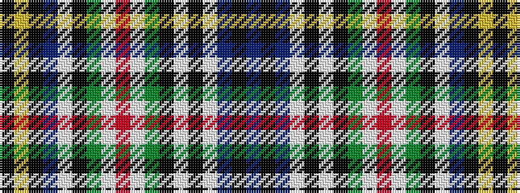

BKBWKWKGWRWGKWBKYK

It is a 18 stripe tartan.

<figure class="pat-woven">

<figcaption>idealised sample</figcaption>
</figure>

## Colour Sequence



## Tartans with this colour sequence

| Tartans |
|---------------|
| [Bell (2015)](/variants/s18/dt7k2dt7w1k2w1k8dg2w3r10w3dg2k8w1dt11k2lr3k2~x2/)|
||
