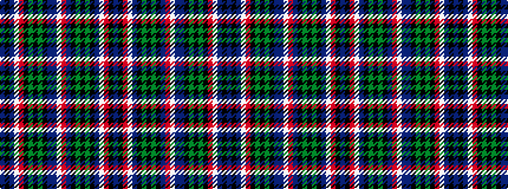

BKBWRKGKGKBBWRBKGKGKBWRKB

It is a 25 stripe tartan.

<figure class="pat-woven">

<figcaption>idealised sample</figcaption>
</figure>

## Colour Sequence



## Tartans with this colour sequence

| Tartans |
|---------------|
| [Scottish American Military](/variants/s25/db11k2r2w2b2k16g16k2g16k16db16r2w2b2db16k16g16k2g16k16r2w2b2k2db11~x2/)|
||
