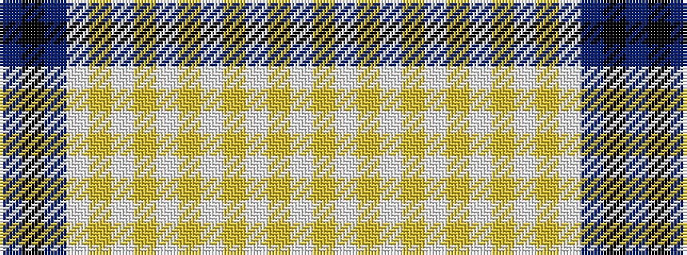

BKBWYWYWYWYWYWY

It is a 15 stripe tartan.

<figure class="pat-woven">

<figcaption>idealised sample</figcaption>
</figure>

## Colour Sequence



## Tartans with this colour sequence

| Tartans |
|---------------|
| [Bush (Artefact)](/setts/s15/t12k8t12w1lo2w1lo8w1lo2w1lo8w1lo2w1lo8/)|
||
